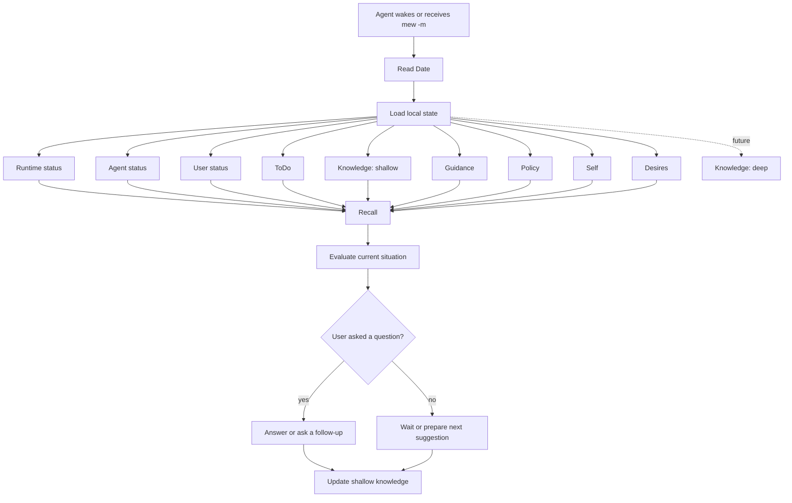
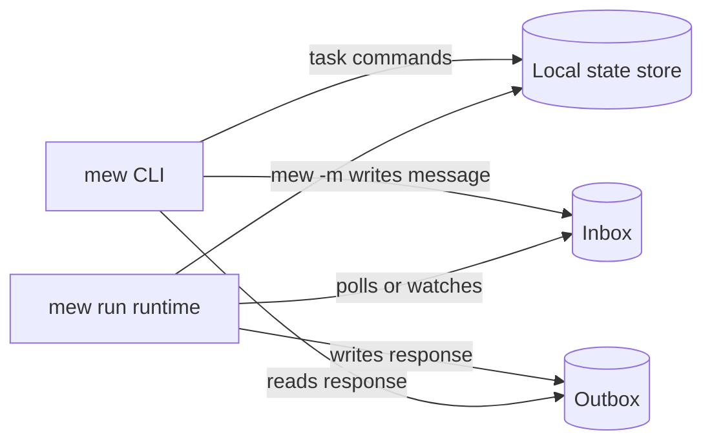

# PRD: Passive AI CLI

## 1. Overview

Passive AI CLI is a personal command-line tool that keeps an AI agent running in the background. Once started, it watches the user's intent, asks follow-up questions when needed, manages tasks, and can launch agents in specific directories to execute work autonomously.

The first version is for personal use. It should prioritize a simple, reliable local workflow over a polished multi-user product.

## 2. Problem

Current agent workflows are mostly active and session-based:

- The user must explicitly start an agent for each task.
- The user must remember what needs to be done.
- The user must decide which directory or project context the agent should run in.
- Long-running or recurring tasks are hard to keep moving without manual prompting.

The desired product is a passive assistant that remains available, notices pending work, and helps move tasks forward with minimal repeated setup.

## 3. Goals

### 3.1 Long-Term Product Goals

- Provide a CLI that can eventually start a passive AI process.
- Ask the user questions when a task is unclear or blocked.
- Launch an agent in a specified directory.
- Execute or monitor tasks through agent sessions.
- Keep enough state to resume after the CLI restarts.

### 3.2 MVP Goals

- Maintain a local task list for the user.
- Provide fast CLI commands for adding, listing, updating, and completing tasks.
- Store task state locally.
- Start a background AI process that can inspect and reason about the task list.
- Validate the core startup sequence before finalizing the user-facing message interface.
- Make task management useful before adding project-directory automation.

## 4. Non-Goals

- Multi-user collaboration.
- Web UI.
- Mobile app.
- Cloud sync.
- Full project management features such as teams, permissions, kanban boards, or complex reporting.
- Fully autonomous destructive actions without user confirmation.

## 5. Target User

The initial target user is the repository owner.

Primary usage context:

- Local development environment.
- CLI-first workflow.
- Multiple local project directories.
- AI coding agents such as Codex or similar agent CLIs.

## 6. Core Concepts

### 6.1 Date

`Date` is the current time context for the agent.

It should answer:

- What day is it?
- What time is it?
- How long has it been since the agent last woke up?
- How long has it been since the user last interacted with the agent?
- Which tasks are relevant now?

The MVP can calculate this from system time and stored timestamps. It does not need a calendar integration.

### 6.2 Agent Status

`Agent status` is the agent's work context, not the process status.

It should answer:

- What was the agent doing?
- What is the agent in the middle of?
- What was the last remembered objective?
- What was the last active task or question?
- What should the agent resume thinking about after waking up?

The agent should remember:

- `mode`: high-level work context such as `idle`, `reviewing_tasks`, `answering_user`, or `waiting_for_user`.
- `current_focus`: short description of what the agent is focused on.
- `active_task_id`: the task currently being considered, if any.
- `pending_question`: the question the agent is waiting for the user to answer, if any.
- `last_thought`: concise summary of what the agent concluded last time.
- `updated_at`: when this context was last updated.

Runtime process state such as `running`, `stopped`, `pid`, and lock ownership belongs to `Runtime status`, not `Agent status`.

### 6.3 Knowledge

`Knowledge` is what the agent uses to remember context beyond a single command.

There are two levels:

- `shallow`: short-term, lightweight memory used by the MVP.
- `deep`: longer-term structured memory for future versions.

MVP `shallow` knowledge should include:

- Recent user messages.
- Recent agent answers.
- The latest task-list summary.
- The last known active or blocked task.
- Lightweight notes the agent needs to answer questions like "What should I do today?"

Future `deep` knowledge may include:

- Long-term user preferences.
- Project-specific context.
- Historical patterns.
- Learned routines.
- Links between tasks, repositories, and goals.

### 6.4 Guidance

`Guidance` is human-written policy for the `think` phase.

It is not learned memory. It is an explicit instruction file written by the user to control priorities and behavior.

The MVP should load guidance from `.mew/guidance.md` and inject it into the `think` prompt.

Example:

```md
以下の優先度で作業する
- 依頼されたもの
- 返答する

返答がなければ以下を作業する
- 自律的にできるタスク
- ローカルdir調査を少し進めてknowledgeを更新
```

Guidance should influence decisions but must not override local safety checks.

### 6.4.1 Policy

`Policy` is human-written safety and boundary instruction.

It is separate from `Guidance`:

- `Guidance` controls priorities.
- `Policy` controls what mew may or may not do.

The MVP should load policy from `.mew/policy.md` and inject it into both `think` and `act`.

Default policy should include:

- Prefer asking before doing anything with external side effects.
- Allow self-directed work only when `mew run --autonomous` is enabled.
- Do not execute tasks unless task execution is explicitly enabled.
- Allow read-only local inspection only under paths passed with `--allow-read`.
- Never read or search sensitive files such as `auth.json`, `.env`, private keys, or token files.
- Preserve local state and history unless the user explicitly asks to remove it.

### 6.4.2 Self

`Self` is human-written identity, purpose, and behavior for mew.

It is loaded from `.mew/self.md` and injected into `think` and `act`.

It should answer:

- What is mew?
- What kind of behavior should mew prefer?
- How should mew behave when idle?
- How should mew treat itself as an improvable project?

### 6.4.3 Desires

`Desires` are human-written long-running preferences for self-directed work.

They are loaded from `.mew/desires.md` and used only when autonomous mode is enabled.

Example desires:

- Keep the task list useful and current.
- Review open questions, attention items, and agent runs.
- Compress noisy memory into durable project knowledge.
- Propose small improvements to mew itself.

### 6.5 User Status

`User status` is the agent's current understanding of the user's work context.

For the MVP, this can be minimal and mostly unknown unless the user states it directly.

It should answer:

- What was the user doing?
- What is the user in the middle of?
- What did the user last ask for?
- Is the user waiting for the agent?
- Is the agent waiting for the user?

Suggested fields:

- `mode`: high-level context such as `unknown`, `working`, `waiting_for_agent`, `blocked`, or `away`.
- `current_focus`: short description of what the user appears to be focused on.
- `last_request`: latest explicit request from the user.
- `last_interaction_at`: when the user last interacted with `mew`.
- `updated_at`: when this context was last updated.

The agent can later use this to decide whether to interrupt, wait, summarize, or ask a question.

### 6.6 Runtime Status

`Runtime status` is the system-level process state.

This is separate from `Agent status`.

It should include:

- `state`: `stopped`, `running`, or `error`.
- `pid`.
- `started_at`.
- `stopped_at`.
- `last_woke_at`.
- `last_evaluated_at`.
- `last_action`.

### 6.7 ToDo

`ToDo` is the task list.

It is the first product surface and the main source of truth for the MVP. The background AI should reason from this task list before any deeper automation exists.

### 6.8 Recall Flow

When the agent wakes up or receives a message, it should first "remember" the current state.

It should reconstruct:

- What should be done?
- What is currently in progress?
- How many hours have passed since the last activation?
- What should happen next?
- Which `shallow` knowledge is relevant?



## 7. Architecture Direction

The background process is acceptable, but it should not be designed as a direct `stdin` chat session.

The user-facing message interface can be decided later. The core contract should be the local runtime, the local state store, and the event loop.

To keep the system easy for AI agents to implement and extend, the MVP should use a small local event-driven architecture:

- `mew`: CLI client.
- `mew run`: long-running local runtime.
- Local state store: durable source of truth for tasks, messages, runtime status, agent status, user status, and shallow knowledge.
- Inbox: user messages and internal wake-up events waiting to be processed.
- Outbox: agent responses and generated suggestions.
- Agent loop: reads events, reconstructs context, decides what to do, writes results back to local state.

This means `mew -m "今日のタスクは何？"` does not need to talk to the AI process through interactive stdin. It can append a message to the local inbox, then either wait for a response or print that the message was queued.

### 7.1 Recommended MVP Process Model



### 7.2 Autonomous Mode

Fully autonomous behavior should use the same event model.

Instead of waiting only for user messages, the runtime can create or consume internal events:

- `tick`: periodic wake-up.
- `scheduled_check`: wake-up at a planned time.
- `task_due`: a task became relevant.
- `user_message`: a message sent through `mew -m`.

This keeps manual interaction and autonomous behavior on the same implementation path.

For the first passive prototype:

- `mew run` wakes every N minutes.
- The runtime should poll for user input more frequently than the passive wake interval.
- If there are pending `user_message` events, it processes those first.
- If there is no pending user input, it creates a `passive_tick` event.
- Runtime cycles should hold the state mutation lock only while selecting or
  committing an event. Resident model calls should run outside the lock so
  `mew message`, `mew chat`, and status commands remain responsive while the
  model is thinking.
- On every event, the agent runs `think` first to create a `DecisionPlan`.
- The agent then runs `act` to convert the `DecisionPlan` into an `ActionPlan`.
- On `passive_tick`, the plan decides whether to ask a question, suggest a next action, or execute an explicitly executable task.
- When `--autonomous` is enabled, `passive_tick` may run `self_review` and propose small tasks from `Self` and `Desires`.
- Autonomous self-review should be rate-limited and should not create a user-visible message on every passive tick.
- When `--autonomous --autonomy-level act` is enabled, `passive_tick` may perform read-only local inspection under paths passed with `--allow-read`.
- When `--autonomous --autonomy-level act --allow-agent-run` is enabled, `passive_tick` may dispatch or review task-linked programmer runs, but only for tasks that are `ready` and `auto_execute=true`.
- The agent should not repeat the same unread question every tick.
- If a `wait_for_user` action contains a concrete question, local code should expose it as one unread outbox question and then suppress duplicates while it remains unanswered.
- Task execution is allowed only for tasks that explicitly contain execution details and are marked for auto-execution.

### 7.3 Think/Act Split

The runtime should separate decision-making from execution.

`think` phase:

- Reads `Date`, `Runtime status`, `Agent status`, `User status`, `ToDo`, `Inbox`, `Outbox`, and `Knowledge: shallow`.
- Reads a bounded raw conversation history of recent user messages and
  human-facing mew replies/questions so multi-turn follow-up can preserve
  wording and not only summary memory.
- Reads human-written `Guidance`.
- Reads human-written `Policy`.
- Reads human-written `Self`.
- Reads human-written `Desires`.
- Reads passive `Perception` observations such as bounded workspace and git status.
- Calls the configured resident model backend.
- Produces a `DecisionPlan`.
- Does not modify task state.
- Does not execute commands.

`act` phase:

- Reads the `DecisionPlan`.
- Calls the configured resident model backend again.
- Produces an `ActionPlan`.
- Local code validates the `ActionPlan`.
- Local code performs approved effects such as writing an outbox message, asking the user a question, waiting for user input, or executing an explicitly allowed task command.
- Local code may perform approved read-only inspection actions such as `inspect_dir`, `read_file`, or `search_text`, but only inside allowed read roots.
- Local code may perform `self_review` and `propose_task` when autonomy policy allows them.
- Local code may create programmer plans, collect existing agent-run results, create review runs, and create follow-up tasks when autonomy policy allows them.
- Local code may start new programmer agent runs only when `--allow-agent-run` is enabled and the action passes local validation.

This gives two separate model calls:

1. `think`: decide what should happen.
2. `act`: decide how to safely perform the selected actions.

Local code remains the final executor and must reject unsafe or unsupported actions.

### 7.4 Implementation Preference

The first core validation should avoid a database.

Use simple local files:

- `.mew/state.json`: durable structured state for tasks, inbox, outbox, runtime status, agent status, user status, and shallow knowledge.
- `.mew/effects.jsonl`: append-only state checkpoint records with save time, process id, state hash, and record counts.
- `.mew/runtime.md`: human-readable runtime log.
- `.mew/runtime.lock`: single-runtime lock.
- `.mew/state.lock`: state mutation lock for runtime/client coordination.
- `.mew/guidance.md`: user-written prioritization rules.
- `.mew/policy.md`: user-written safety boundaries.
- `.mew/self.md`: user-written self/personality instructions.
- `.mew/desires.md`: user-written self-directed desires.

`mew run` should initialize default guidance and policy files if they are
missing. When autonomous mode is enabled, it should also initialize default self
and desires files so the first autonomous run has explicit editable instructions.

The JSON state remains the source of truth for now, but runtime model latency
must not keep the state lock held. The current safe pattern is:

1. Acquire `.mew/state.lock`.
2. Load state, create/select one pending event, update runtime status, and save.
3. Release `.mew/state.lock`.
4. Build context and call resident model THINK/ACT.
5. Reacquire `.mew/state.lock`.
6. Reload state, apply the selected event's action plan if it is still pending,
   save, and release the lock.

This is intentionally optimistic concurrency. If the user queues a new message
while the resident model is thinking, that new message is saved immediately and
handled by a later cycle. The in-flight model plan is not rebuilt unless its
selected event was already processed before commit. If that selected event has
already been processed, the stale plan must be discarded without emitting
messages or effects.

Read-only verification actions may also be precomputed outside the state lock.
Before doing so, the runtime must briefly re-read the selected event under the
state lock and skip precompute if that event is no longer pending. The runtime
should commit only the verification result and resulting messages under the
lock. Mutating effects such as task command execution and file writes need
stricter effect-intent/recovery semantics before they can safely move out of
the commit phase.

Use a `uv` Python project layout:

- `pyproject.toml`: package metadata and `mew = "mew.cli:main"` console script.
- `uv.lock`: locked project resolution.
- `src/mew/`: package implementation.
- `./mew`: local compatibility wrapper for direct execution during development.

Current package boundaries:

- `src/mew/cli.py`: argparse wiring and entrypoint.
- `src/mew/commands.py`: user-facing command handlers such as task, message, attach, and listen.
- `src/mew/runtime.py`: long-running runtime loop and startup/shutdown sequence.
- `src/mew/agent.py`: think/act prompts, plan normalization, and ActionPlan application.
- `src/mew/model_backends.py`: resident model adapter layer.
- `src/mew/perception.py`: passive read-only workspace observers for model context.
- `src/mew/codex_api.py`: Codex Web API OAuth loading, streaming call, and JSON extraction.
- `src/mew/state.py`: local JSON state, runtime locks, inbox/outbox primitives, guidance, policy, self, and desires files.
- `src/mew/tasks.py`: task queries, formatting, and command execution.
- `src/mew/agent_runs.py`: task-linked `ai-cli` agent run creation, waiting, and result capture.
- `src/mew/read_tools.py`: validated read-only local inspection tools.
- `src/mew/toolbox.py`: bounded local command and read-only git helpers for `mew tool`.
- `src/mew/brief.py`: compact operational brief generation.
- `src/mew/config.py`, `src/mew/errors.py`, `src/mew/timeutil.py`: shared constants and small utilities.

This is enough to validate whether the startup sequence, recall flow, and event loop work. SQLite can be reconsidered later only if JSON file coordination becomes a real problem.

The first real resident model backend should be Codex Web API, called directly with an OAuth access token from `auth.json`.
The second resident model backend is Claude Messages API, called with
`ANTHROPIC_API_KEY` or an explicit key file.

Backend selection should be explicit at runtime:

```sh
mew run --ai --model-backend codex --auth auth.json
mew run --ai --model-backend claude
```

The model adapter layer should keep `think` and `act` independent from any one provider. Codex is the first implementation, not a permanent architectural assumption.

Initial assumptions:

- Do not shell out to Codex CLI.
- Read OAuth credentials from `./auth.json` first, then `~/.codex/auth.json`.
- Use the OAuth `access` token or `tokens.access_token`.
- Send requests to `https://chatgpt.com/backend-api/codex/responses`.
- Include `chatgpt-account-id` when `accountId` or `tokens.account_id` is available.
- Use streaming responses with `stream: true` and `store: false`.

### 7.5 Agent-Initiated Messages

The agent can create messages even when the user has not sent `mew -m`.

These should use the same local event architecture:

1. The runtime wakes up because of an internal event such as `tick`, `scheduled_check`, or `task_due`.
2. The runtime reconstructs context from `Date`, `Runtime status`, `Agent status`, `User status`, `ToDo`, and `Knowledge: shallow`.
3. If it has something useful to say, it writes an agent message to `outbox`.
4. The user reads that message through a CLI interface.

Agent-initiated messages should not require a direct terminal session with the agent. They should be durable records in `outbox`.

Recommended message types:

- `info`: low-priority observation.
- `suggestion`: suggested next action.
- `question`: the agent needs user input.
- `warning`: something may need attention soon.

Possible later CLI interfaces:

- `mew inbox`: show unread agent messages.
- `mew ack <message-id>`: mark an agent message as read or handled.
- `mew reply <message-id> <text>`: answer an agent question.

Current CLI interfaces:

- `mew message "<message>" --wait`: queue one message and wait for outbox responses linked to that event.
- `mew listen`: stream newly created agent messages until stopped.
- `mew attach`: stream newly created agent messages, runtime activity, and allow interactive message sending.
- `mew attach -m "<message>"`: queue an initial message and keep listening for the response.
- `--unread` can be used to print unread existing messages before streaming.
- `--history` can be used to print all existing messages before streaming.
- `mew attach --no-activity` can hide runtime activity and show only outbox messages.

For the MVP, `mew run` may also print agent-initiated messages to its own foreground terminal for debugging. The durable interface should still be `outbox`, because later daemon mode will not have a visible terminal.

## 8. Core Validation Phase

Before polishing the CLI interface, the project should first prove that the core runtime can start correctly, reconstruct state, process events, and persist its result.

This is the first implementation milestone.

### 8.1 Startup Sequence

The first validation should prove this sequence:

1. `mew run` starts a foreground runtime process.
2. The runtime opens or initializes the local JSON state file.
3. The runtime applies any required schema migrations.
4. The runtime acquires a single-runtime lock.
5. The runtime writes `runtime_status = running`.
6. The runtime records `started_at` and `last_woke_at`.
7. The runtime loads `Date`, `Runtime status`, `Agent status`, `User status`, `ToDo`, and `Knowledge: shallow`.
8. The runtime creates or consumes one internal wake-up event.
9. The runtime performs the recall flow.
10. The runtime writes a result to `outbox` or a runtime log table.
11. The runtime updates `last_evaluated_at`.
12. The runtime exits cleanly on interrupt and writes `runtime_status = stopped`.

### 8.2 Validation Criteria

The core validation succeeds when:

- `mew run` can start from an empty repository state.
- A local JSON state file is created if missing.
- Running `mew run` twice does not create two active runtimes.
- Runtime status is persisted and inspectable.
- Agent work context is persisted and inspectable.
- The runtime can reconstruct context from persisted state.
- The runtime can process at least one internal event without user input.
- The runtime can write an agent-generated message or evaluation result.
- Restarting `mew run` can see the previous state and compute elapsed time.
- Interrupting the process leaves the state store usable.

### 8.3 Non-AI Test Mode

The first core validation does not need a real AI backend.

It can use a deterministic evaluator that:

- Reads the current task list.
- Reads the current shallow knowledge.
- Calculates elapsed time from timestamps.
- Writes a simple summary such as "No open tasks" or "3 open tasks".
- Updates `Knowledge: shallow` with the latest summary.

This keeps the runtime, persistence, lock, and event loop testable before introducing model behavior.

### 8.4 Codex Web API Test Mode

After the non-AI startup sequence works, the next validation is the same sequence with Codex Web API enabled.

The runtime should:

- Load OAuth credentials from `auth.json`.
- Build a prompt from `Date`, `Runtime status`, `Agent status`, `User status`, `ToDo`, `Knowledge: shallow`, and the current event.
- POST to Codex Web API directly.
- Parse the streamed response.
- Write the assistant text into `outbox`.
- Update `Knowledge: shallow` with the assistant result.

### 8.5 Core-First Implementation Rule

Until the startup sequence is proven, avoid spending time on:

- Final CLI message interface design.
- Desktop notifications.
- Daemon installation.
- Agent execution inside project directories.
- Deep knowledge.
- Polished natural-language behavior.

## 9. MVP Scope

The first MVP is task management plus a background AI interface.

The product should still prove task management first. The background AI exists so the task list can be evaluated conversationally and eventually become passive.

The MVP should support the smallest useful loop for capturing, organizing, progressing, and asking about personal tasks from the CLI:

1. Start a background AI process with `mew run`.
2. Track basic `Runtime status`.
3. Send messages to the background AI with `mew -m "<message>"`.
4. Let the AI read `Date`, `Runtime status`, `Agent status`, `User status`, `ToDo`, and `Knowledge: shallow`.
5. Add tasks from the CLI.
6. List open tasks.
7. Show task details.
8. Update task title, description, status, priority, and notes.
9. Mark tasks as done.
10. Store tasks locally.
11. Preserve task state after the CLI exits.

Project-directory automation and agent execution inside specific repositories are intentionally outside the first MVP.

## 10. Example User Flows

### 10.1 Start Background AI

```sh
mew run
```

Expected behavior:

- The CLI starts a long-running local AI process.
- The process loads the local task state.
- The process stays available for later CLI messages.
- The process can evaluate the task list and answer questions about it.

### 10.2 Ask About Tasks

```sh
mew -m "今日のタスクは何？"
```

Expected behavior:

- The CLI sends the message to the running background AI.
- The AI reads the current task state.
- The AI answers based on the stored tasks.
- If the background process is not running, the CLI returns a clear error or offers to start it.

### 10.3 Add a Task

```sh
mew task add "Review the auth refactor"
```

Expected behavior:

- A new task is saved locally.
- The task starts in `todo` status.
- The CLI prints the created task ID.

### 10.4 List Tasks

```sh
mew task list
```

Expected behavior:

- The CLI shows open tasks.
- Each row includes task ID, status, priority, and title.
- Done tasks are hidden by default.

### 10.5 Update a Task

```sh
mew task update <task-id> --status ready --priority high
```

Expected behavior:

- The selected task is updated.
- The updated timestamp changes.
- The CLI prints the updated task summary.

### 10.6 Complete a Task

```sh
mew task done <task-id>
```

Expected behavior:

- The task status changes to `done`.
- Done tasks no longer appear in the default task list.

## 11. Functional Requirements

### 11.1 CLI Commands

The first user-facing version should likely include:

- `mew run`: start the background AI process.
- `mew run --allow-read <path>`: allow bounded read-only inspection under a local path.
- `mew run --allow-write <path>`: allow gated file writes under a local path.
- `mew run --autonomous`: let mew do self-directed work when no user input is pending.
- `mew run --autonomy-level observe|propose|act`: control how much freedom autonomous mode has.
- `mew run --allow-agent-run`: allow autonomous programmer dispatch/review runs.
- `mew run --allow-verify --verify-command <command>`: allow act-level runtime verification using the configured bounded command.
- `mew run --verify-interval-minutes <minutes>`: set the minimum interval between autonomous verification runs.
- `mew run --auto-archive`: archive old processed inbox and read outbox records while the runtime is active.
- `mew run --echo-outbox`: print newly created outbox messages in the runtime terminal for debugging.
- `mew start -- <run-args>`: start `mew run` in the background and write process output to `.mew/runtime.out`.
- `mew status`: show whether the background AI is running and what it last did.
- `mew status --json`: show runtime status and counters as structured JSON.
- `mew stop`: stop the active background runtime and wait for shutdown.
- `mew doctor`: check local state, state validation, latest state checkpoint, runtime lock, and required local tools.
- `mew doctor --json`: expose the same health check as structured JSON for agents and automation.
- `mew repair`: reconcile and validate local state, then write a fresh checkpoint when validation passes.
- `mew repair --force`: allow repair while a runtime lock is active; default repair should refuse active runtimes.
- `mew repair --json`: expose the repair pass as structured JSON.
- `mew effects`: show recent append-only state checkpoint records.
- `mew effects --json`: expose state checkpoint records as structured JSON.
- `mew brief`: show the current operational summary and next useful move.
- `mew brief --json`: expose the operational summary as structured JSON for other agents.
- `mew focus`: show a quiet daily next-action view with open questions, attention, top tasks, and the current next useful move.
- `mew daily`: alias for the quiet focus view.
- `mew activity`: show only recent runtime activity, action counts, and dropped-thread warnings.
- `mew context`: show resident prompt context diagnostics and approximate section sizes.
- `mew step`: run a bounded manual feedback loop. It plans a passive step,
  filters out writes, task execution, and agent dispatch, applies safe
  read/memory/question/task-proposal actions, and records the actions, skipped
  actions, and visible effects for the next step.
- Autonomous read-only actions should use recent memory, thoughts, and step
  results before inspecting again; short-term duplicate inspections should be
  skipped unless the user explicitly requested them.
- Routine autonomous read progress should remain available in history/live
  streams while being marked read by default, so unread outbox focuses on
  user-facing replies, questions, and warnings.
- `mew snapshot --allow-read <path>`: refresh structured project snapshot memory from bounded local reads.
- `mew dogfood`: run an isolated short passive-runtime check and print a structured dogfood report.
- `mew dogfood --source-workspace <path>`: copy a non-sensitive repository snapshot into the dogfood workspace before running.
- `mew dogfood --pre-snapshot`: refresh project snapshot memory before the dogfood runtime starts.
- `mew dogfood --cycles <n>`: reuse one dogfood workspace across multiple runtime cycles and report the aggregate.
- `mew dogfood --report <path>`: write the structured dogfood report to JSON for later inspection.
- `mew next`: print the single next useful command or move.
- `mew next --json`: print the next move and extracted command as structured JSON.
- `mew verification`: show recent runtime verification runs.
- `mew writes`: show recent runtime write/edit runs and optional diffs.
- `mew thoughts`: show recent thought journal entries and unfinished thought threads.
- `mew tool`: expose safe AI-facing workspace inspection, write/edit, search, test, and read-only git helpers.
- `mew self-improve`: create and optionally dispatch a mew self-improvement task.
- `mew -m <message>`: send a message to the running background AI.
- `mew message <message> --wait`: send a message and wait for responses linked to that event.
- `mew listen`: stream newly created outbox messages.
- `mew listen --activity`: stream newly created outbox messages and runtime activity.
- `mew attach -m <message>`: send a message and listen for responses in one client process.
- `mew chat`: open a human-facing REPL with message input, outbox streaming, activity streaming, and slash commands.
- `mew session`: open a JSON Lines control session for scripts and future richer frontends. It accepts typed requests such as `status`, `brief`, `focus`, `daily`, `activity`, `questions`, `attention`, `outbox`, `ack`, `message`, `reply`, `defer_question`, `reopen_question`, `wait_outbox`, `next`, and `stop`, and returns typed JSON responses with request ids when provided. `focus` returns a `focus` payload, `daily` returns the same shape as a `daily` payload, and `message` requests may pass `wait=true` to wait for outbox responses from the queued event.
- `mew chat` slash commands should expose cockpit controls such as `/add`, `/show`, `/note`, `/why`, `/thoughts`, `/digest`, `/attention`, `/resolve`, `/approve`, `/plan`, `/dispatch`, `/self`, `/result`, `/wait`, `/review`, `/followup`, `/retry`, `/sweep`, `/verify`, `/pause`, `/resume`, and `/mode`.
- `mew questions`: show open questions that block progress.
- `mew questions --defer <question-id>`: defer a question so `mew next` can move on without treating it as blocking.
- `mew questions --reopen <question-id>`: make a deferred question active again.
- `mew reply <question-id> <text>`: answer a specific question and preserve the conversation link.
- `mew ack <message-id...>`: mark one or more outbox messages as read.
- `mew ack --all`: mark all unread outbox messages as read.
- `mew attention`: show what currently needs the user's attention.
- `mew attention --resolve <attention-id>` and `--resolve-all`: close attention items the user has handled.
- `mew archive`: dry-run archival for processed inbox, read outbox, completed agent runs, and old verification/write records.
- `mew archive --apply`: write `.mew/archive/` and compact active state.
- `mew memory`: show shallow memory and recent remembered events.
- `mew memory --compact`: compact recent shallow events into durable project memory.
- `mew task run <task-id>`: start an agent run for a coding task.
- `mew task plan <task-id>`: create a programmer plan for implementation and review.
- `mew task dispatch <task-id>`: start an implementation agent run from a programmer plan.
- `mew agent list/show/wait/result`: inspect and collect agent-run results.
- `mew agent review <run-id>`: start a review agent run for an implementation run.
- `mew agent followup <run-id>`: create a follow-up task from a review run.
- `mew agent followup <run-id> --ack --note <text>`: mark a review follow-up processed when it was handled elsewhere.
- `mew agent retry <run-id>`: start a retry implementation run using the same task and plan context.
- `mew agent sweep`: collect running results, flag stale runs, optionally start reviews, and process completed review follow-ups.
- `mew guidance init`: create `.mew/guidance.md`.
- `mew guidance show`: show the current think-phase guidance.
- `mew policy init`: create `.mew/policy.md`.
- `mew policy show`: show the current safety/boundary policy.
- `mew self init`: create `.mew/self.md`.
- `mew self show`: show the current self/personality instructions.
- `mew desires init`: create `.mew/desires.md`.
- `mew desires show`: show the current self-directed desires.
- `mew task add <text>`: add a task. `--kind coding|research|personal|admin|unknown` may be used to override task classification, and `--ready` can create an immediately actionable task.
- `mew task classify [task-id]`: inspect stored, inferred, and effective task kind; `--mismatches`, `--apply`, and `--clear` help repair stale task-kind overrides.
- `mew task list --kind <kind>`: list only tasks matching a specific task kind.
- `mew task list`: list tasks.
- `mew task show <task-id>`: show task details.
- `mew task update <task-id>`: update task fields.
- `mew task done <task-id>`: mark a task complete.
- `mew buddy [--task <task-id>]`: advance one coding task through the programmer loop. The default creates or reuses a plan; `--dispatch --dry-run` previews the implementation run, and explicit `--dispatch` or `--review` moves further. Long waits remain under `mew agent wait <run-id>`.
- `.codex/skills/mew-product-evaluator/SKILL.md`: project skill for evaluating
  mew by asking whether a resident AI would want to be inside it, not only
  whether the code works.

Exact command names can change during implementation.

The following message interfaces are intentionally deferred until the core runtime is proven:

- `mew inbox`: show unread agent-initiated messages.
- `mew ack <message-id>`: mark an agent message as handled.
- `mew reply <message-id> <text>`: answer an agent question.

### 11.2 State Model

The MVP should persist local state for:

- `runtime_status`: current process state and timestamps.
- `agent_status`: current agent work context.
- `user_status`: current inferred or user-provided work context.
- `tasks`: task records.
- `inbox`: pending user messages and internal wake-up events.
- `outbox`: agent responses, suggestions, questions, warnings, and unread messages.
- `knowledge.shallow`: recent lightweight memory.
- `guidance`: human-written instructions loaded from `.mew/guidance.md`.
- `policy`: human-written boundaries loaded from `.mew/policy.md`.
- `self`: human-written identity and behavior loaded from `.mew/self.md`.
- `desires`: human-written self-directed goals loaded from `.mew/desires.md`.
- `autonomy`: whether autonomous mode is enabled, its level, cycle counts, and last self-review timestamps.
- `memory`: shallow current context plus deep preferences, project knowledge, and decisions.
- `thought_journal`: bounded per-event working memory with summaries, open thought
  threads, resolved threads, dropped threads, and compact action digests.
- `questions`: first-class questions with answer status and task/blocking links.
- `replies`: answers linked to questions and user-message events.
- `attention`: open items that explain what needs user focus.
- `agent_runs`: task-linked coding-agent runs, initially via `ai-cli`.
- `verification_runs`: bounded runtime verification command results.
- `write_runs`: audited runtime write/edit attempts and their diffs.

The runtime should read guidance before each `think` phase so edits can take
effect without restarting a long-running passive process.

The runtime should read policy before each `think` and `act` sequence so safety
boundaries can be tightened without restarting a long-running passive process.

The runtime should read self and desires before each `think` and `act` sequence
so edits can steer autonomous behavior without restarting a long-running passive
process.

`Date` should usually be calculated from the current system time and stored timestamps.

Full deep-memory synthesis is out of scope for the first MVP, but the MVP may
append simple project, preference, and decision notes when actions produce useful
facts.

The MVP should provide deterministic memory compaction that summarizes recent
shallow events into `memory.deep.project` and retains only a configurable recent
tail. AI-assisted memory synthesis can be added later.

Read-only inspection actions should also refresh a structured
`memory.deep.project_snapshot` with repository shape, key files, detected project
types, package metadata, and recent file/search observations. This gives the
resident model a compact project map without repeatedly reading the same files.

### 11.3 Task Model

Each task should include:

- ID.
- Title.
- Description.
- Status.
- Priority.
- Notes.
- Command, if the task can be executed locally.
- Working directory, if the task has a command.
- Auto-execute flag.
- Agent backend, if the task should be delegated to an agent runner.
- Agent model, if a non-default model should be used.
- Agent prompt, if the task needs a prompt override.
- Latest agent run ID.
- Programmer plans, including implementation prompt, review prompt, done criteria, model, and working directory.
- Run history for command execution.
- Created timestamp.
- Updated timestamp.

Suggested task statuses:

- `todo`
- `ready`
- `running`
- `blocked`
- `done`

### 11.4 Task Management

The CLI should be able to:

- Create a task with a title.
- Optionally add a description or notes.
- List tasks with useful default sorting.
- Filter tasks by status.
- Update task fields.
- Mark a task as done.
- Show task details.
- Optionally attach a local command and working directory to a task.
- Create a programmer plan for a task.
- Dispatch a planned implementation to an agent run.

### 11.4.1 Programmer Loop

The programmer loop turns a task into a reviewable agent workflow:

1. `mew task plan <task-id>` creates a structured plan on a coding task.
2. `mew task dispatch <task-id>` starts an implementation `ai-cli` run from that plan.
3. `mew agent wait <run-id>` or `mew agent result <run-id>` collects the implementation result.
4. `mew agent review <run-id>` starts a separate review run.
5. `mew agent followup <review-run-id>` records the review status and creates a follow-up task when needed.
6. `mew agent retry <failed-run-id>` starts a retry implementation run with the previous result and stderr in context.

Implementation runs may update the task status. Review runs must not mark the original task done or blocked by themselves. When a completed review is processed and reports `needs_fix`, the follow-up step may create a new task and move the original task back to `blocked` so it is not hidden as complete.

Autonomous programmer behavior uses the same loop:

- `propose` mode may create a programmer plan for an unplanned open coding task. Personal, admin, research, and unknown tasks should stay in the general next-action flow until the user explicitly routes them into programmer work.
- `act` mode may dispatch a planned implementation only when `--allow-agent-run` is enabled and the task is `ready` with `auto_execute=true`.
- Existing running agent runs may be checked on passive wakes.
- Completed implementation runs may receive review runs only when `act` and `--allow-agent-run` are both enabled.
- Completed review runs may create follow-up tasks when their report says more work is needed.
- Runtime verification may run only when `act`, `--allow-verify`, and a configured
  `--verify-command` are present. Passive verification respects
  `--verify-interval-minutes`. Results are stored in state and failures create
  attention items.
- Manual chat verification may run through `/verify <command>`, storing the
  result in the same verification history and creating a high-priority attention
  item on failure.
- Open verification failure attention items may cause autonomous `propose` or
  `act` mode to create a high-priority repair task, unless a matching open
  repair task already exists.

`mew agent sweep` is the manual maintenance entrypoint for this lifecycle. It
should be able to collect running results, flag stale runs as attention items,
report implementation runs that need review, optionally start review runs, and
process review follow-ups.

### 11.4.2 Self-Improvement

`mew self-improve` creates a first-class task for improving mew itself.

It should:

- Reuse an open self-improvement task by default.
- Build the task description from the current brief and next move.
- Create a programmer plan unless `--no-plan` is passed.
- Optionally mark the task ready and auto-executable.
- Optionally dispatch an implementation run when explicitly requested.
- Optionally run a supervised cycle that dispatches implementation, waits for
  completion, starts review, processes follow-up, and stops unless review passes.
- Optionally run a supervisor-owned verification command after implementation
  and before review, stopping the cycle when verification fails.

This keeps self-improvement supervised by default while making it easy to hand a
small, reviewable improvement to the programmer loop.

`mew chat` should expose the same supervised self-improvement path through
`/self`, so a long-lived cockpit session can create or reuse the improvement
task, ensure a plan, preview prompts, and optionally dispatch a dry-run or live
implementation run without leaving chat.

### 11.5 Background AI

The background AI should be able to:

- Start with `mew run`.
- Track and expose `Runtime status`.
- Update `Agent status` as work context changes.
- Poll or watch the local inbox.
- Read the local task state.
- Read `Knowledge: shallow`.
- Calculate elapsed time from `Date` and stored timestamps.
- Answer questions sent with `mew -m`.
- Process internal wake-up events.
- Summarize current tasks.
- Identify blocked or unclear tasks.
- Suggest next actions.
- Create unread `outbox` messages without a user prompt when useful.
- Run self-review when `--autonomous` is enabled.
- Propose new tasks when `--autonomous --autonomy-level propose` or `act` is enabled.
- Execute one ready auto-execute task during a passive wake.
- Start a task-linked agent run when the task explicitly allows it.
- Plan, dispatch, review, and follow up on task-linked programmer runs.
- Perform read-only project inspection when `--allow-read` grants a local root.
- Track open questions, replies, attention items, and agent runs as durable concepts.
- Avoid modifying tasks unless the user explicitly asks it to.

The MVP does not require arbitrary project work execution. It may execute only explicit local task commands or explicitly configured `ai-cli` agent runs that the user marked for auto-execution.

Autonomy levels:

- `observe`: remember and self-review only.
- `propose`: `observe` plus creating proposed tasks and programmer plans for coding tasks.
- `act`: `propose` plus bounded read-only inspection under `--allow-read`, gated writes under `--allow-write`, and programmer dispatch/review when `--allow-agent-run` is enabled.

Local command execution still requires `--execute-tasks`, `auto_execute=true`, and an explicit command. Autonomous programmer agent dispatch requires `--allow-agent-run`, `auto_execute=true`, `status=ready`, and a programmer plan.
Runtime write actions require `--allow-write`; non-dry-run runtime writes also
require `--allow-verify` and a configured `--verify-command`, and should trigger
verification immediately after writing. Runtime write actions default to dry-run
unless the action explicitly sets `dry_run=false`. If verification fails after a
runtime write, mew should restore the previous content or remove the newly
created file and record the rollback in `write_runs`.

### 11.6 Out of Scope for MVP

The following capabilities are important to the overall product but should not be built in the first MVP:

- Unbounded autonomous follow-up without cooldown or an unread-message check.
- Desktop notifications.
- Rich deep-memory synthesis beyond the initial preferences/project/decisions buckets.

### 11.7 Local Persistence

State should be stored locally.

Recommended core validation option:

- `.mew/state.json` for structured state.
- Save-time state invariant validation and `next_ids` reconciliation.
- `.mew/effects.jsonl` for append-only state checkpoint records.
- `.mew/runtime.md` for human-readable runtime logs.

Optional later support:

- Per-session JSONL event logs with write-time persistence modes.
- SQLite database for queryable thread/session metadata.
- Recovery commands that rebuild state from checkpoints and event logs.

The initial goal is to prove behavior, not storage sophistication. SQLite can be introduced later if concurrent writes, querying, resume, or migration complexity justify it.

## 12. Safety Requirements

- The CLI must not overwrite or lose existing task data.
- The CLI should handle a missing or empty local state file.
- State migration should reconcile ID counters from existing records to avoid duplicate task, message, question, plan, or agent-run IDs.
- The CLI should handle invalid task IDs clearly.
- The CLI should not require network access for task management.
- The background AI should only read and write the local task store through the same task management API.
- The background AI should ask before making bulk task changes.
- The background AI should only inspect local project files under explicit `--allow-read` roots.
- The background AI should only write local project files under explicit `--allow-write` roots.
- The background AI should preview small writes with dry-run when practical.
- The background AI should refuse sensitive files such as `auth.json`, `.env`, private keys, and token files even when they are inside an allowed read root.
- The background AI should refuse writing sensitive files such as `auth.json`, `.env`, private keys, and token files even when they are inside an allowed write root.
- The background AI should not use read-only inspection results as permission to execute commands.
- Autonomous programmer dispatch/review should require `--allow-agent-run`; without it, the runtime may plan but must not start a new agent run.
- Review agent runs should be read-only by prompt and should not directly change the original task status.

## 13. Success Criteria

The success criteria are not fully defined yet. Initial candidate criteria:

- The user can add tasks without leaving the terminal.
- The user can list current open tasks.
- The user can update task status and priority.
- The user can mark tasks as done.
- Task data remains available after restarting the CLI.
- The user can start a background AI with `mew run`.
- The user can ask `mew -m "今日のタスクは何？"` and receive a useful answer based on local tasks.
- The agent can create an unread message or evaluation result without a user prompt.
- The agent can ask a durable question and accept a linked `mew reply`.
- The agent can launch or track a task-linked `ai-cli` run when explicitly configured.
- The agent can run the programmer loop from plan to implementation run to review run to follow-up task under explicit gates.
- The agent can update memory from bounded read-only inspection.
- The user can manage at least one day of personal tasks with the CLI.

## 14. Open Questions

- What should the product name be: `mew`, `passive-ai`, or something else?
- What fields are required for a task beyond title and status?
- Should task state live in the repository, the user's home directory, or a configurable path?
- What task statuses are actually useful for personal use?
- Should task IDs be numeric, short random IDs, or slugs?
- Should `mew run` run in the foreground, as a daemon, or support both?
- Should `mew -m` wait for a response or only enqueue messages by default?
- Should `mew -m` auto-start the background process if it is not running?
- What should the agent-initiated message interface be after the core runtime is proven?
- Should `mew inbox` show all unread messages or only higher-priority messages by default?
- Should `mew listen` be part of the first user-facing MVP or only a developer/debug command?
- How much `shallow` knowledge should be retained?
- When should `shallow` knowledge be compressed or discarded?
- How should the user explicitly set or clear `User status`?
- What does "successful task management" mean after one week of real use?

## 15. Future Scope

After the task management MVP works, later versions can add:

- Autonomous questions without an explicit `mew -m` prompt.
- Recurring tasks.
- Task suggestions from git state, issues, notes, or project files.
- Desktop notifications and richer interruption policy.
- Richer agent-run review loops, retries, and task decomposition.
- Memory compression and long-term project knowledge synthesis.
- Typed local control plane for machine-facing sessions and health checks.
- Per-session append-only transcript/event logs with compaction checkpoints.
- Platform-aware sandbox and execution policy layers before broader autonomous command execution.
- Resume/recovery pipeline that sanitizes interrupted turns before model replay.
